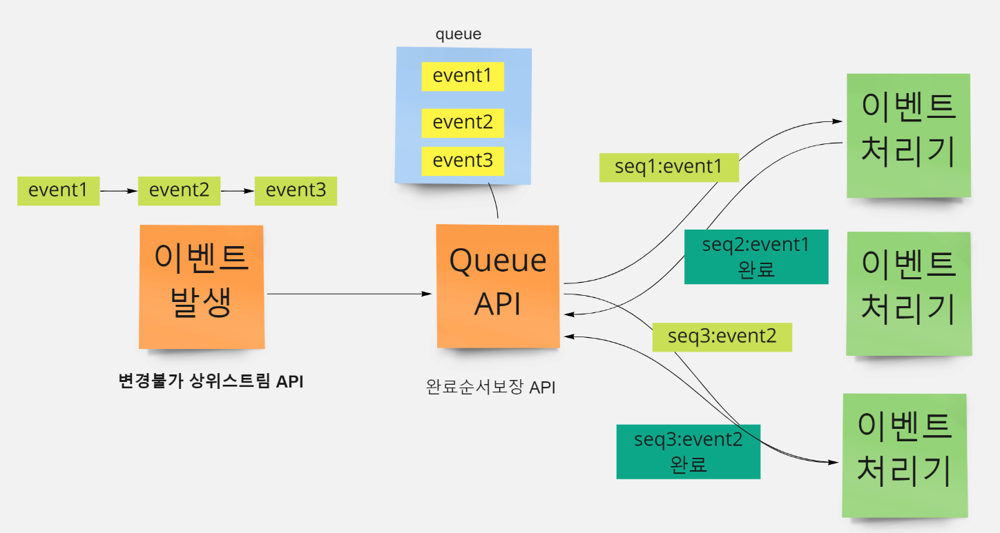
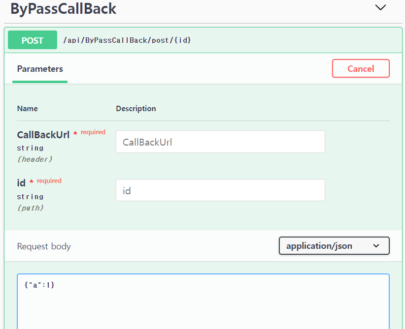

# BypassQueueAPI

API 기능 : API요청완료를, 손서보장을 시킵니다.

사용목적 : 이벤트 발생(주로 웹훅을 호출하는경우)지점 수정이 불가능하고
웹훅으로 연결된 스트리밍 웹훅 API 요청완료에 대해 순차완료보장이 필요한경우 (Lock사용 불필요)

## 컨셉

### 문제

이벤트가 순차적으로 발생하고, 분산된 서버(또는 비동기로 처리되는 서버)가
다음과 같은 전화기 이벤트를 처리한다고 가정해봅시다.

발생이벤트 순서
- 1.전화 이벤트
- 2.전화받기 이벤트
- 3.전화 끊기 이벤트

이것을 차례로 처리한다고, 순차적으로 처리완료가 된다라고 착각할수 있습니다. 
하지만 각각의 이벤트의 완료순서가 다르기때문에 순차완료가 보장이 안됩니다.

이벤트를 처리하는 서버가 동기적(순서대로) 으로밖에 처리못하고 처리기가 단 하나일때

전화 이벤트가 처리중인 상태에서, 전화 끊기 이벤트가 수행되어 
순서에의해 동작오류가 발생할수 있습니다. 

동시성의 완료순서를 보장하기위해 다음과 같은 전략을 사용할수 있습니다.

- 다양한 Lock 모델사용 : 락으로 인해 대기상태에 빠질수 있으며, 이벤트유실을 포함 데드락이 걸릴수 있습니다. 결정적으로 분산된 환경에서 리소스 잠금은 구현이 어렵습니다.
- DB Lock 사용 : 트랙젝션간 동일데이터 변경을 보호하기 위한 용도이며, 쿼리에따라 RowLock이 아닌 테이블락으로 작동될 가능성이 있으며 결정적으로 순차처리를 위한 용도로 사용될수 없습니다. 데드락이 될 가능성이 높습니다.

### 순차적 완료를 보장

해결컨셉:
순차처리가 필요한 그룹을 지정하여, 해당 그룹에 소속된 그룹의 이벤트만 순차 처리가 가능합니다.
순차처리를 유지하고, 동시성을 높이려면 순차처리 단위 그룹을 논리적으로 분리하면 됩니다.
이 순차 그룹은 액터하나에 해당합니다.

TYPE A: 직접 WebHook 받을시

TYPE B: WebHook Target수정불가시 - ByPass+CallBack 방식으로 작동할시

##
    완료시간이 제각각이여도, 요청 순서대로 완료보장~

    info: QueueByPassAPI.Controllers.ByPassCallBackController[0]
          [REQNO-1] Done TestCallBack 2 , Completed Time 508
    [INFO][2022-05-20 오전 6:55:09][Thread 0018][akka://akka-universe/user/group1] Received PostSpec message: http://localhost:9000/api/ByPassCallBack/test
    info: QueueByPassAPI.Controllers.ByPassCallBackController[0]
          PostTodoItem
    info: QueueByPassAPI.Controllers.ByPassCallBackController[0]
          TestCallCount 6
    info: QueueByPassAPI.Controllers.ByPassCallBackController[0]
          PostTodoItem
    info: QueueByPassAPI.Controllers.ByPassCallBackController[0]
          TestCallCount 7
    info: QueueByPassAPI.Controllers.ByPassCallBackController[0]
          [REQNO-2] Done TestCallBack 3 , Completed Time 918
    [INFO][2022-05-20 오전 6:55:10][Thread 0008][akka://akka-universe/user/group1] Received PostSpec message: http://localhost:9000/api/ByPassCallBack/test
    info: QueueByPassAPI.Controllers.ByPassCallBackController[0]
          [REQNO-3] Done TestCallBack 4 , Completed Time 724
    [INFO][2022-05-20 오전 6:55:11][Thread 0004][akka://akka-universe/user/group1] Received PostSpec message: http://localhost:9000/api/ByPassCallBack/test
    info: QueueByPassAPI.Controllers.ByPassCallBackController[0]
          [REQNO-4] Done TestCallBack 5 , Completed Time 765
    [INFO][2022-05-20 오전 6:55:11][Thread 0028][akka://akka-universe/user/group1] Received PostSpec message: http://localhost:9000/api/ByPassCallBack/test
    info: QueueByPassAPI.Controllers.ByPassCallBackController[0]
          [REQNO-5] Done TestCallBack 6 , Completed Time 1061
    [INFO][2022-05-20 오전 6:55:13][Thread 0018][akka://akka-universe/user/group1] Received PostSpec message: http://localhost:9000/api/ByPassCallBack/test
    info: QueueByPassAPI.Controllers.ByPassCallBackController[0]
          [REQNO-6] Done TestCallBack 7 , Completed Time 1332

## API DOC

- CallBackURL : 이 API를 호출하면, 요청데이터를 큐에적재합니다. 그리고 순차완료를 보장하기위해서 하나씩 꺼내서 CallBack을 수행합니다.
- id : GroupID에 해당하며 여기에 소속된 그룹만 동시완료처리를 보장합니다. 동시처리를 높이려면 이 그룹을 논리적으로 구분합니다. 이것은 장비ID일수도있고, 도메인ID일수도 있습니다.
- body : 콜백시 요청을 해야할 실제 데이터입니다.